# shopify_backend_challenge

Shopify 2022 Backend Challenge - Spring Boot Implementation

Hello and welcome to my Inventory Management Web application.

*All software and technologies used, were at their latest version as of January 19, 2022

This readme will show you how to get the backend server and MySQL database started up.

# Database Setup

The backend uses a MySQL server to store all records (Version 8.0.27 , current version is 8.0.28 running on port 3306)

First download MySQL from https://dev.mysql.com/downloads/

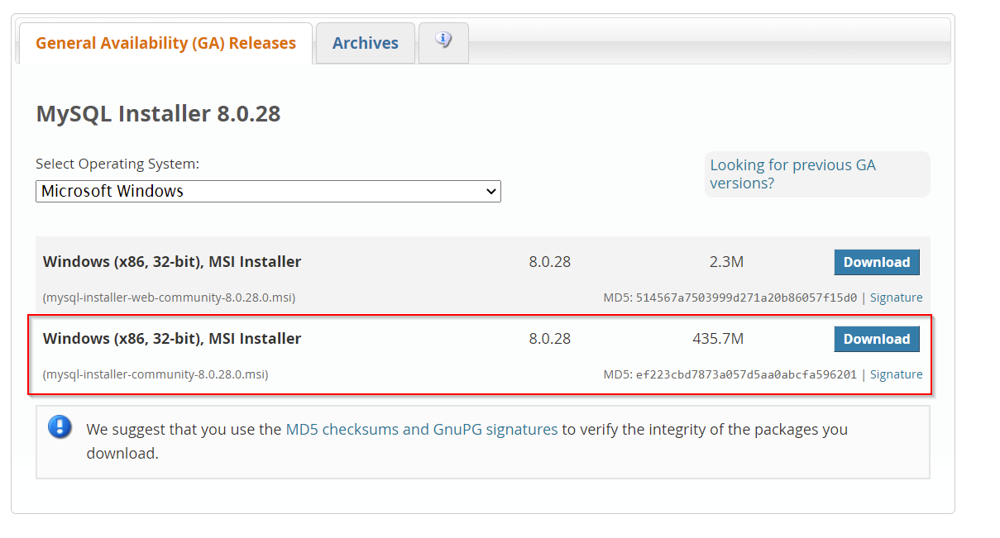

Use the highlighted download, web-community tends to be buggy

When installing use 'Developer Default'

During installation, it will say that you do not have Visual Studio 2015 and Python 64-bit just skip that and click next
on installation.

**Installation takes a while

*During installation you will be asked to create a password please remember this info

When Configuring the product just keep everything as default and next/continue

Once done installing start the MySQL server, it should automatically start after you hit finish

Open up MySQL workbench and click on local instance

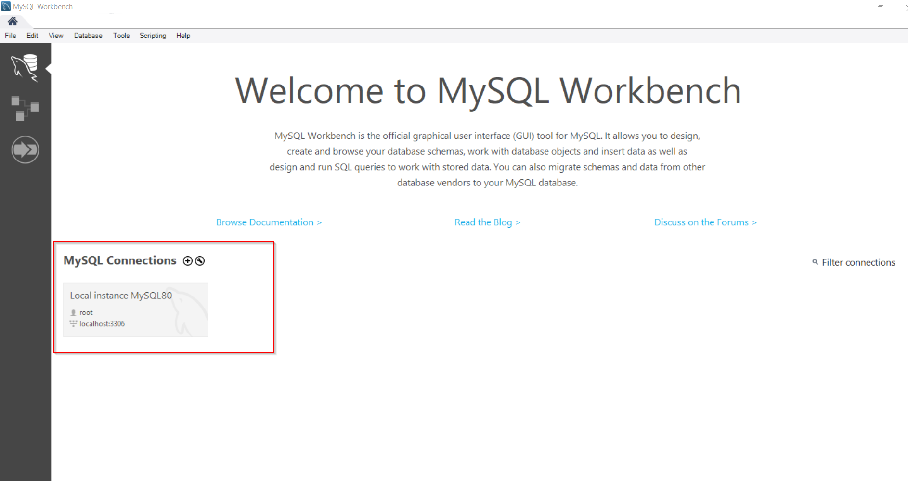

it will ask you for your password you made during installation.

Once inside run the following query by clicking the yellow lightning symbol

```sql
create database item_management_system;
```

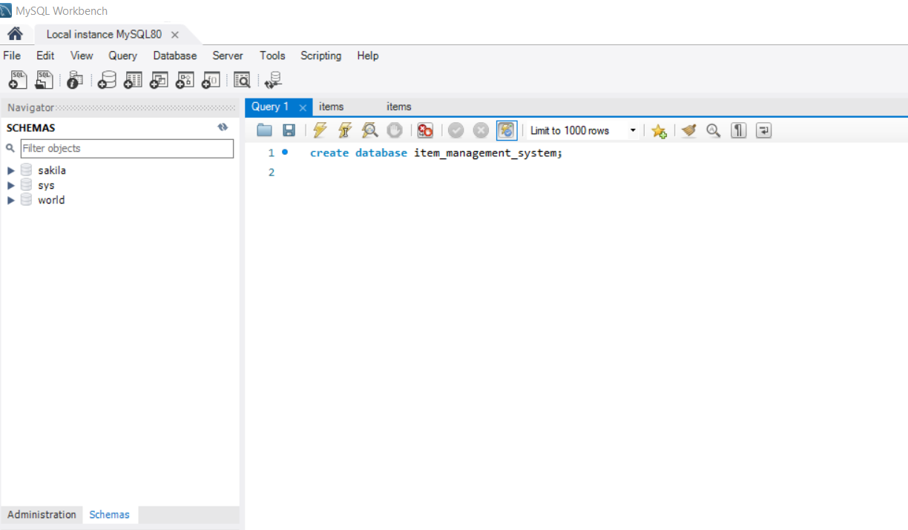

Hit the small refresh button next to 'SCHEMAS'

and you will see a database called item_management_system

Now that the DB is set up we can move onto the backend.

## Backend Architecture Info

*All development was done on Windows 10 Home, version 21H2, OS Build: 19044.1466

The backend server was implemented in the Java 8 Language, using the Spring Boot Framework v2.6.2 The backend server is
an Apache Tomcat Server running on Port 8080.

To add and use the Java 8 or 1.8, Do the following,

`Ctrl+Alt+Shift+S`

Click the SDK drop down menu, Choose "Add SDK" then click Download JDK

A new window should appear, select from the versions drop down menu version "1.8"

From the vendor drop down choose "Eclipse Temurin (AdoptOpenJDKHotSpot)"

Download this JDK to wherever you want.

IDE used by me was JetBrains Intellij Ultimate Edition however since the ultimate edition is not free, it is possible to
run just using, Intellij Community
Edition. [Intellij Community Edition](https://www.jetbrains.com/idea/download/#section=windows)

### Instructions for running locally on Intellij Community Edition

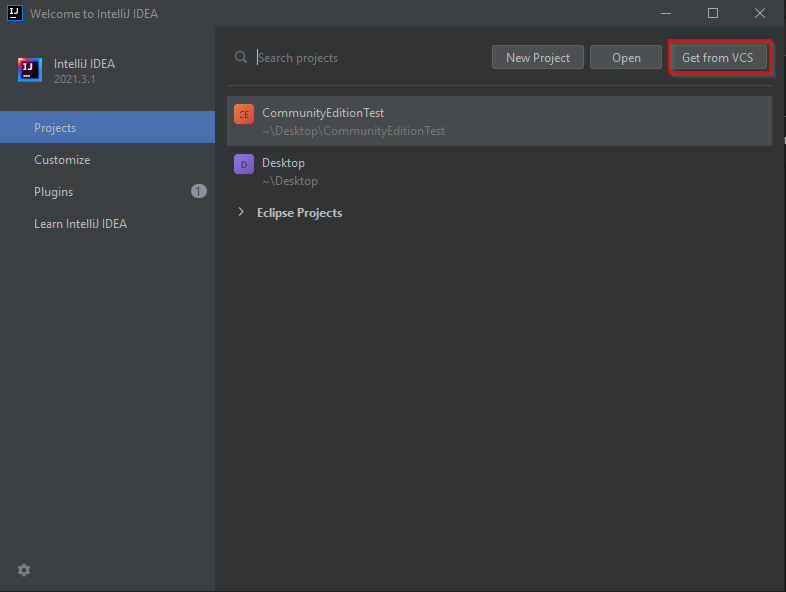 

*Click the 'Get from VCS' button on the top right highlighted in red.

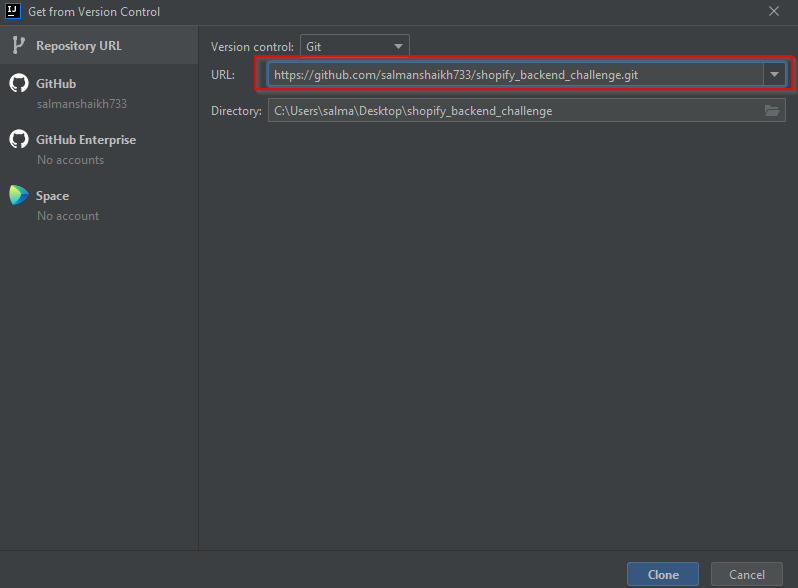 

Now in the URL section highlighted in red put the following GitHub URL to clone the backend project.

* https://github.com/salmanshaikh733/Shopify-Technical-Challenge2022-BackEnd.git

Next hit clone and the project should open, wait for the IDE to index the code and for maven to load the pom.

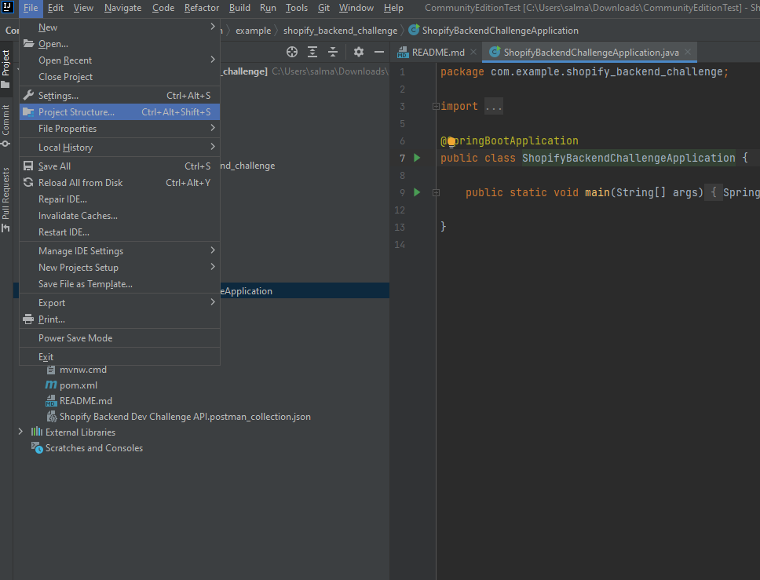 

Once the project is loaded you may be asked to specify a project SDK. Open File in the top righ and select 'Project
Structure'

Once there select JDK 8 as the SDK for this project.

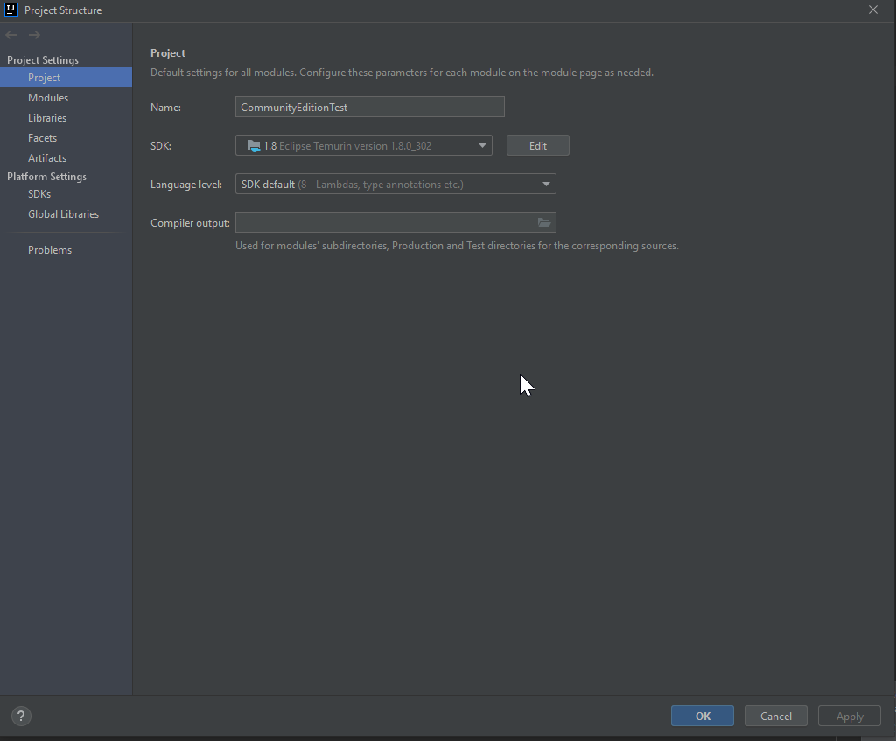 

In the case of the maven not recognizing the project (Which should not happen)
Right click the 'pom.xml' file and select Maven and then select 'Reload Project'

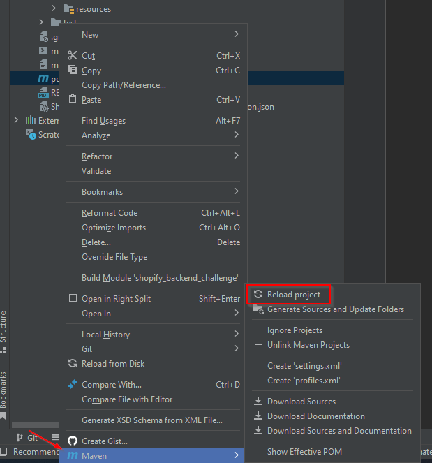 

To run the project navigate to the main runnable file
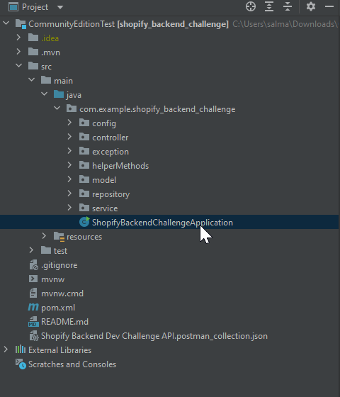

Next Hit the Green play button.
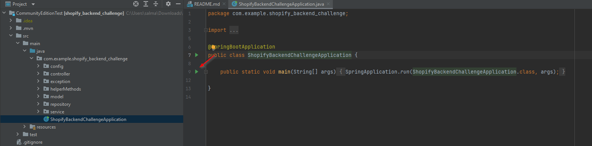

The backend server will now be running on port 8080.
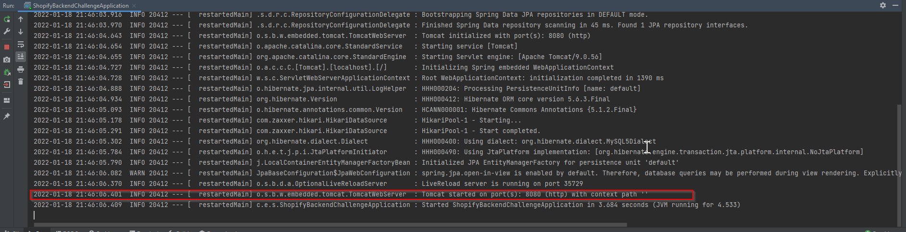

Open Chrome or any web-browser other than Internet Explorer. paste: http://localhost:8080/api/v1/items

Should be empty or return nothing. But the backend service should be up.

All spring dependencies should be available in the pom.xml file. You can see what dependencies I used for this project
and what version they are.

*You should not need Apache Maven installed on your PC to run this locally intellij comes built in with Maven.

I have included a postman collection as a json file to import into your postman to test the backend api's.

Now to get some initial data in our Database run the following query on MYSQL Workbench

```sql
INSERT INTO item_management_system.items (id, item_name, item_price, item_quantity)
VALUES (23, 'M1 Macbook', 2000.5, 49);
INSERT INTO item_management_system.items (id, item_name, item_price, item_quantity)
VALUES (38, 'Shirts', 5, 1000);
INSERT INTO item_management_system.items (id, item_name, item_price, item_quantity)
VALUES (65, 'PS5 Digital Edition', 500, 0);
INSERT INTO item_management_system.items (id, item_name, item_price, item_quantity)
VALUES (40, 'PS4', 399, 0);
INSERT INTO item_management_system.items (id, item_name, item_price, item_quantity)
VALUES (41, 'Ipad Pro', 500, 50);
INSERT INTO item_management_system.items (id, item_name, item_price, item_quantity)
VALUES (42, 'Iphone 13 Pro', 1000, 25);
INSERT INTO item_management_system.items (id, item_name, item_price, item_quantity)
VALUES (43, 'Samsung Galaxy S21 Ultra', 1200, 100);
INSERT INTO item_management_system.items (id, item_name, item_price, item_quantity)
VALUES (44, 'Smart Watch v2', 301, 100);
INSERT INTO item_management_system.items (id, item_name, item_price, item_quantity)
VALUES (48, 'PS3 Slim', 250, 67);
INSERT INTO item_management_system.items (id, item_name, item_price, item_quantity)
VALUES (55, 'Printer', 324, 29);
INSERT INTO item_management_system.items (id, item_name, item_price, item_quantity)
VALUES (66, 'Xbox Series X', 500, 25);
```

If you try making another request
http://localhost:8080/api/v1/items

you should see a list of items from the DB

# API Information / Documentation

## Get All Items

`Get http://localhost:8080/api/v1/items`

Returns a list of all items

### Request Info and Sample Response

    {
     [ 
        {   "id": 66,
            "itemName": "Xbox Series X",
            "quantity": 25,
            "price": 500.0
        },
        {
            "id": 64,
            "itemName": "testv66",
            "quantity": 150,
            "price": 5.5
        }, 
    ]
    },

## Add new Item

`POST http://localhost:8080/api/v1/add-item`

### Sample Request Body

    {
        "itemName": "testv66",
        "quantity": 150,
        "price": 5.5
    }

## Get Specific Item By ID

`GET http://localhost:8080/api/v1/get-item/{id}`

### Sample Response

    {
    "id": 38,
    "itemName": "Shirts",
    "quantity": 1000,
    "price": 5.0
    } 

## Update Item by ID

    `PUT http://localhost:8080/api/v1/update-item/{id}`

will update item specified by id in the DB, using the request body given in request

### Sample Request Body

    {
        "itemName": "PS5 Disk Edition",
        "quantity": 0,
        "price": 10.9
    }

### Sample Response - ID assigned by DB

    {
        "id": 39,
        "itemName": "PS5 Disk Edition",
        "quantity": 0,
        "price": 10.9
    }

## Delete Item

`DELETE http://localhost:8080/api/v1/delete-item/{id}`

Will delete item specified by id in url path

No request or response body for this request.

## Change Quantity

`PUT http://localhost:8080/api/v1/change-item-quantity/{id}/true`

Updates quantity of item based on path variables provided, true means increment, false means decrement

### Sample Response - ID assigned by DB

    {
        "id": 63,
        "itemName": "XBox Series X",
        "quantity": 2,
        "price": 600.0
    }

## Get Product as CSV

`GET http://localhost:8080/api/v1/download-csv`

Returns all product data in DB as downloadable CSV on front-end

### Sample Response of CSV

    {
        Item ID,Item Name,Item Quantity,Item Price
        23,M1 Macbook,49,2000.5
        38,Shirts,1000,5.0
        65,PS5 Digital Edition,0,500.0
        40,PS4,0,399.0
        41,Ipad Pro,50,500.0
        42,Iphone 13 Pro,25,1000.0
        43,Samsung Galaxy S21 Ultra,100,1200.0
        44,Smart Watch v2,100,301.0
        48,PS3 Slim,67,250.0
        55,Printer,29,324.0
        64,testv66,150,5.5
        66,Xbox Series X,25,500.0
    }


